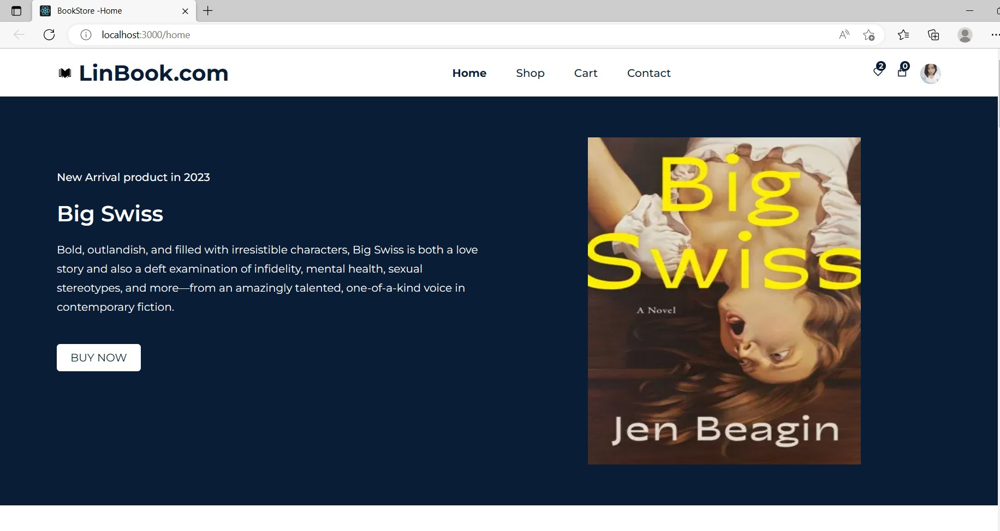
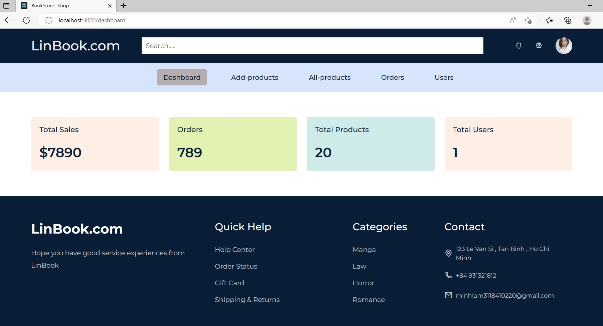

# BOOK STORE

This project was bootstrapped with [Create React App](https://github.com/facebook/create-react-app).

 ## Setting

In the project directory, you can run:

### `npm start`

Runs the app in the development mode.\
Open [http://localhost:3000](http://localhost:3000) to view it in your browser.

The page will reload when you make changes.\
You may also see any lint errors in the console.

### `npm test`

Launches the test runner in the interactive watch mode.\
See the section about [running tests](https://facebook.github.io/create-react-app/docs/running-tests) for more information.

### `npm run build`

Builds the app for production to the `build` folder.\
It correctly bundles React in production mode and optimizes the build for the best performance.

The build is minified and the filenames include the hashes.\
Your app is ready to be deployed!

See the section about [deployment](https://facebook.github.io/create-react-app/docs/deployment) for more information.

### `npm run eject`

**Note: this is a one-way operation. Once you `eject`, you can't go back!**

If you aren't satisfied with the build tool and configuration choices, you can `eject` at any time. This command will remove the single build dependency from your project.

## About Project

The book-selling website includes a variety of book genres to choose from. Stoppers can buy by adding products to the cart, filling in the necessary information and placing an order.

## Technology used
- HTML/CSS , Javascript 
- Use [ReactJs] 18 for this project (https://react.dev/).
- [Nodejs] (https://nodejs.org/en)
- Use [Boostrap] version 5 support make UI(https://getbootstrap.com/).

## Main function
 - Login ,logout for customer
 - Add , Edit , Delete products ,admin users in Admin panel
 - Search book
 - Add product to cart
 - Update and delete product in cart

## Overview Website

 - Customer UI
    

      
     

 - Admin Pannel

  

  
  

## Website source code
 - [Visit to get the link](https://github.com/minhlam3118410220)

## License

The project makes it accessible to everyone to learn how to build a better website

